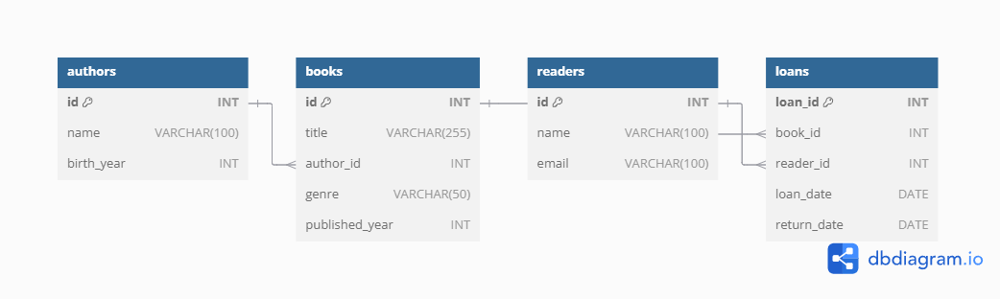

# Library Management System

A simple SQL-based project for managing a library system. This project helps to manage books, authors, readers, and loans efficiently.

## Features
- **Books Management**: Add and manage book details like title, author, genre, and publication year.
- **Loan Tracking**: Record and monitor book loans and returns.
- **Overdue Detection**: Identify books that have not been returned on time.
- **Readers Management**: Maintain a database of library members.

## Database Structure
- **Books**:
  - `id`: Unique identifier for each book.
  - `title`: Title of the book.
  - `author_id`: Author of the book (foreign key).
  - `genre`: Genre of the book.
  - `published_year`: Year of publication.

- **Authors**:
  - `id`: Unique identifier for each author.
  - `name`: Full name of the author.
  - `birth_year`: Year of birth.

- **Readers**:
  - `id`: Unique identifier for each reader.
  - `name`: Full name of the reader.
  - `email`: Contact email.

- **Loans**:
  - `loan_id`: Unique identifier for each loan.
  - `book_id`: Loaned book (foreign key).
  - `reader_id`: Borrower (foreign key).
  - `loan_date`: Date when the book was loaned.
  - `return_date`: Date when the book was returned.

## How to Use
1. Clone this repository:
    ```bash
    git clone https://github.com/your-username/Library-Management-System.git
    ```
2. Import the `schema.sql` and `data.sql` files into your database (e.g., MySQL, PostgreSQL).
3. Test the functionality with queries in `queries.sql`.

## Example Queries
1. Find all books by a specific author:
    ```sql
    SELECT title FROM books
    WHERE author_id = 1;
    ```
2. List overdue books:
    ```sql
    SELECT b.title, r.name, l.loan_date
    FROM loans l
    JOIN books b ON l.book_id = b.id
    JOIN readers r ON l.reader_id = r.id
    WHERE l.return_date IS NULL AND l.loan_date < CURRENT_DATE - INTERVAL '30 DAYS';
    ```

## Tools
- Database: MySQL (or other SQL-based systems).
- SQL Syntax: Standard SQL.

## Future Improvements
- Add functionality for fines on overdue books.
- Implement a web interface for easier library management.
- Expand the system to include multiple library branches.

## The database schema diagram


